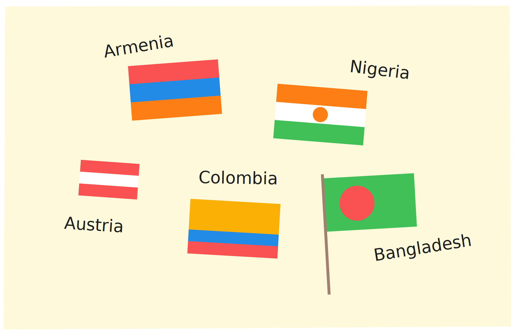

# Basic data

Imagine that you are starting a graphic design company, and want to be
able to create images of flags of different sizes and configurations for
your customers. The following diagram shows a sample of the images that
your software will have to help you create:



Before we try to write code to create these different images, you should
step back, look at this collection of images, and try to identify
features of the images that might help us decide what to do. To help
with this, we're going to answer a pair of specific questions to help us
make sense of the images:

- What do you notice about the flags?
- What do you wonder about the program that might produce them?

> [!NOTE]
> Take some time to think and write down your answers. Noticing features
> of data and information is an essential skill in computing.

Some things you might have noticed:

- Some flags have similar structure, just with different colors.
- Some flags come in different sizes.
- Some flags have poles.
- Most of these look pretty simple, but some real flags have more
  complicated figures on them.

Some things you might have wondered:

- Do I need to be able to draw these images by hand?
- Will we be able to generate different sized flags from the same code?
- What if we have a non-rectangular flag?

The features that we noticed suggest some things we'll need to be able
to do to write programs to generate flags:

- We might want to compute the heights of the stripes from the overall
  flag dimensions (we'll write programs using **numbers**).
- We need a way to describe colors to our program (we'll learn
  **strings**).
- We need a way to create images based on simple shapes of different
  colors (we'll create and combine **expressions**).

Let's get started!

## Numbers

Start simple: compute the sum of 3 and 5.

To do this computation with a computer, we need to write down the
computation and ask the computer to run or evaluate the computation so
that we get a number back. A software or web-application in which you
write and run programs is called a **programming environment**. In the
first part of this course, we will use a language and an environment
called **Pyret**.

Go to [Pyret's online editor]. For now, we will work only in the
right-hand side, called the **interactions pane**.

The `>>>` is called the **prompt** — that's where we tell Pyret which
computation to run. Let's tell it to add 3 and 5. Here's what we write
(don't copy the prompt):

```pyret
>>> 3 + 5
```

Press the Return key, and the result of the computation will appear on
the line below the prompt, as shown below:

```pyret
>>> 3 + 5
8
```

Not surprisingly, we can do other arithmetic computations:

```pyret
>>> 2 * 6
12
```

> [!NOTE]
> `*` is how we write the multiplication sign in most programming
> languages.

What if we try `3 + 4 * 5`? Try it, and see what Pyret says.

Pyret gave you an error message. What it says is that Pyret isn't sure
whether we mean `(3 + 4) * 5` or `3 + (4 * 5)`. So it asks us to include
parentheses to make that explicit. Every programming language has a set
of rules about how you have to write down programs. Pyret's rules
require parentheses to avoid ambiguity.

```pyret
>>> (3 + 4) * 5
35
>>> 3 + (4 * 5)
23
```

Another Pyret rule requires spaces around the arithmetic operators. See
what happens if you forget the spaces:

```pyret
>>> 3+4
```

Pyret will show a different error message that highlights the part of
the code that isn't formatted properly, along with an explanation of the
issue that Pyret has detected. To fix the error, you can press the
up-arrow key within the right pane and edit the previous computation to
add the spaces.

What if we want to get beyond basic arithmetic operators? Let's say we
want the minimum of two numbers. We'd write this as `num-min(2, 8)`. Try
it in Pyret! We'll come back to this notation.

[Pyret's online editor]: https://code.pyret.org/editor

## Expressions

Note that when we run `num-min`, we get a number in return (as we did
for `+` and `*`). This means we should be able to use the result of
`num-min` in other computations where a number is expected:

```pyret
>>> 5 * num-min(2, 8)
10
>>> (1 + 5) * num-min(2, 8)
12
```

Hopefully you are starting to see a pattern. We can build up more
complicated computations from smaller ones, using operators to combine
the results from the smaller computations. We will use the term
**expression** to refer a computation written in a format that Pyret can
understand and evaluate to an answer.

## Terminology

Look at a computation like:

```pyret
>>> (3 + 4) * (5 + 1)
42
```

There are actually several kinds of information here, and we should give
them names:

- **Expression**: a computation written in the formal notation of a
  programming language Examples here include `4`, `5 + 1`, and
  `(3 + 4) * (5 + 1)`.
- **Value**: an expression that can't be computed further (it is its own
  result). So far, the only values we've seen are numbers.
- **Program**: a sequence of expressions that you want to run.

## Strings

What if we wanted to write a program that used information other than
numbers, such as someone's name? For names and other text-like data, we
use what are called strings. Here are some examples:

```pyret
"Kathi"
"Go Bears!"
"CSCI0111"
"Carberry, Josiah"
```

What do we notice? Strings can contain spaces, punctuation, and numbers.
We use them to capture textual data. For our flags example, we'll use
strings to name colors: "red", "blue", etc.

Note that strings are case-sensitive, meaning that capitalization
matters (we'll see where it matters shortly).

## Images

We have seen two kinds of data: numbers and strings. For flags, we'll
also need images. Images are different from both numbers and strings
(you can't describe an entire image with a single number — well, not
unless you get much farther into programming, but let's not get ahead of
ourselves).

Pyret has built-in support for images. When you start up Pyret, you'll
see a grayed-out line that says `use context essentials2024` (or
something similar). This line configures Pyret with some basic
functionality beyond basic numbers and strings.

Press the "Run" button to activate the features in essentials, then
write each of these Pyret expressions at the interactions prompt to see
what they produce:

- `circle(30, "solid", "red")`
- `circle(30, "outline", "blue")`
- `rectangle(20, 10, "solid", "purple")`

Each of these expressions names the shape to draw, then configures the
shape in the parentheses that follow. The configuration information
consists of the shape dimensions (the radius for circles, the width and
height for rectangles, both measured in screen pixels), a string
indicating whether to make a solid shape or just an outline, then a
string with the color to use in drawing the shape.

Which shapes and colors does Pyret know about? Hold this question for
just a moment. We'll show you how to look up information like this in
the documentation shortly.

### Combining images

Earlier, we saw that we could use operators like `+` and `*` to combine
numbers through expressions. Any time you get a new kind of datum in
programming, you should ask what operations the language gives you for
working with that data. In the case of images in Pyret, the collection
includes the ability to:

- rotate them,
- scale them,
- flip them,
- put two of them side by side,
- place one on top of the other,
- and more.

Let's see how to use some of these. Type the following expressions into
Pyret:

```pyret
rotate(45, rectangle(20, 30, "solid", "red"))
```

What does the `45` represent? Try some different numbers in place of the
`45` to confirm or refine your hypothesis.

Let's try another:

```pyret
overlay(circle(25, "solid", "yellow"),
  rectangle(50, 50, "solid", "blue"))
```

Can you describe in prose what `overlay` does?

And finally:

```pyret
above(circle(25, "solid", "red"),
  rectangle(30, 50, "solid", "blue"))
```

What kind of value do you get from using the `rotate` or `above`
operators? Hint: your answer should be one of "number", "string", or
"image".

These examples let us think a bit deeper about expressions. We have
simple values like numbers and strings. We have operators or
**functions** that combine values, like `+` or `rotate` ("functions" is
the term more commonly used in computing, whereas your math classes
likely used "operations"). Every function produces a value, which can be
used as input to another function. We build up expressions by using
values and the outputs of functions as inputs to other functions.

For example, we used `above` to create an image out of two smaller
images. We could take that image and rotate it using the following
expression:

```pyret
rotate(45,
  above(circle(25, "solid", "red"),
    rectangle(30, 50, "solid", "blue")))
```

This idea of using the output of one function as input to another is
known as **composition**. Most interesting programs arise from composing
results from one computation with another. Getting comfortable with
composing expressions is an essential first step in learning to program.
